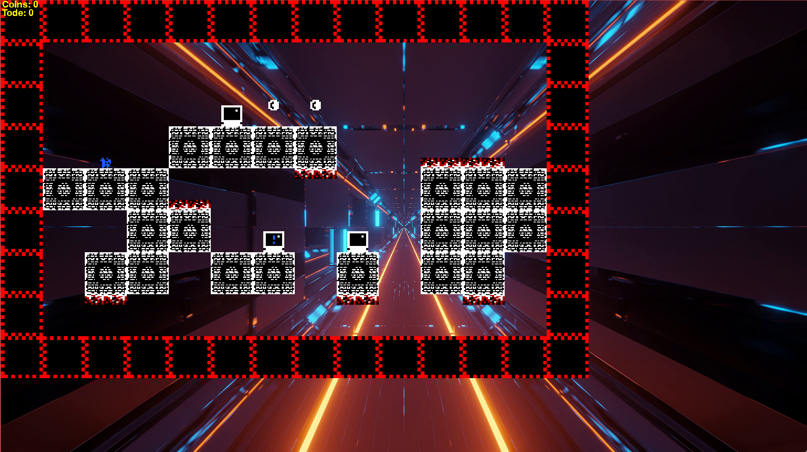

# PyGame-Jump-n-Run

Ein kleines Jump-and-Run Spiel für das Modul objektorientierte Skriptsprachen.

## Screenshot

Quelle der Sprites: [Dunjo | Tileset & Sprites](https://arks.itch.io/dungeon-platform-tileset)

## requirements

pygame

siehe [requirements.txt](requirements.txt)

## Steuerung

Bewegen mit den Pfeiltasten, zum Springen Pfeiltaste nach oben

## Features
* mehrere Levels
* bewegende Blöcke und Gegener
* Checkpoints
* Münzen
* Highscore